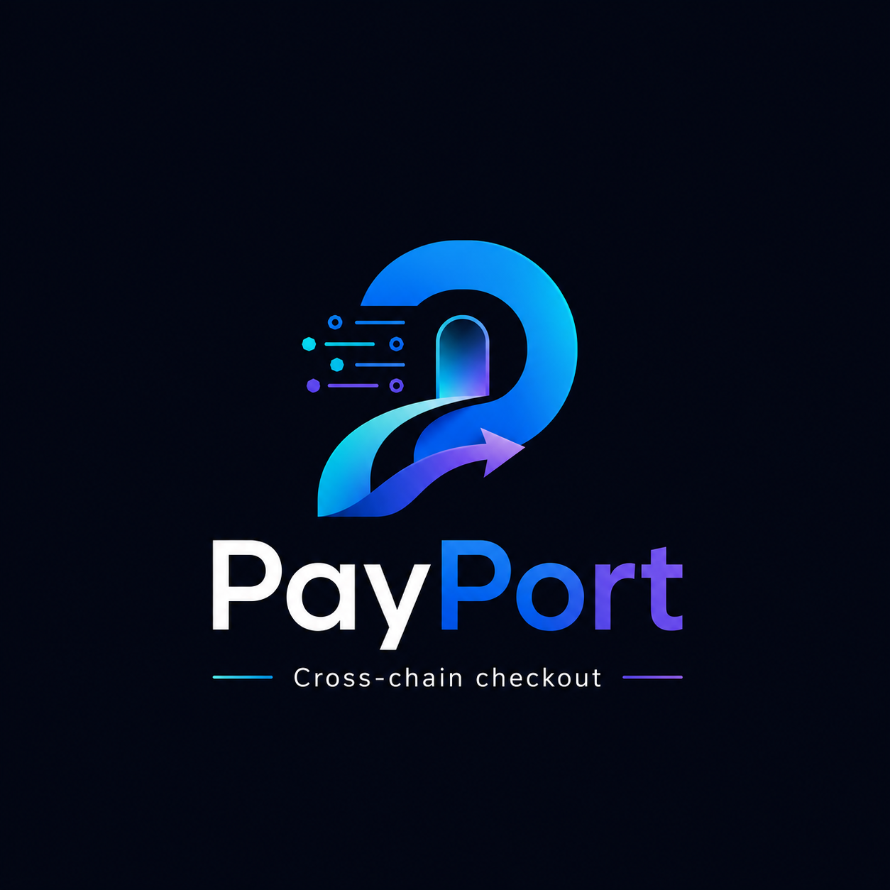

# PayPort



PayPort makes the chain disappear for the buyer, while preserving proof for the merchant.

PayPort is a consumer-grade cross-chain checkout platform for the UXmaxx Hackathon by Encode Club. Buyers log in with email or Google, see one spendable balance, and pay through Particle Universal Accounts in EIP-7702 mode. Merchants receive settlement evidence on Arbitrum One.

## Problem

Crypto checkout still asks normal buyers to bridge, switch networks, manage gas, and install browser wallets. That is too much friction for consumer commerce.

## Solution

PayPort gives the buyer a familiar checkout while keeping verifiable Web3 proof for the merchant:

1. Magic embedded wallet signs the buyer in.
2. Particle Universal Accounts abstracts balances and execution.
3. Arbitrum One records settlement evidence.
4. Railway stores attempts, settlements, and receipts.
5. The `/proof` page shows the evidence package for judges.

## Hackathon Tracks

- Primary: Particle Network Universal Accounts Track
- Bonus: Arbitrum bounty
- Bonus target: Magic Labs embedded wallet

## Architecture

```text
Buyer
  -> Next.js checkout
  -> Magic embedded wallet
  -> Particle Universal Account in EIP-7702 mode
  -> tiny-value mainnet payment
  -> Fastify API on Railway
  -> PostgreSQL via Prisma
  -> Arbitrum One settlement contract
  -> receipt and judge proof page
```

## Tech Stack

- Frontend: Next.js App Router, TypeScript, Tailwind CSS, shadcn/ui, Framer Motion, Lucide React, Magic SDK, Particle UA SDK beta, viem, zod
- Backend: Fastify, TypeScript, Prisma, Railway PostgreSQL, viem, zod, `@fastify/cors`, dotenv
- Contracts: Solidity and Foundry
- Deployment: Vercel, Railway, Railway PostgreSQL, Arbitrum Sepolia rehearsal, Arbitrum One final proof

## Why Magic Is Primary

Standard external RPC wallets generally do not expose the EIP-7702 authorization flow required for the Particle Universal Accounts proof path. PayPort uses Magic embedded wallet onboarding so judges can test checkout without installing MetaMask.

## Why Particle UA Proof Is Mainnet

For this hackathon, Particle Universal Accounts are mainnet-only. Sepolia is reserved for contract rehearsal and local development. The final proof must be a tiny-value mainnet operation.

## Why Arbitrum One

Arbitrum One is the settlement evidence chain for the final proof. The backend writes merchant-facing settlement records there with a Railway-only executor key.

## Current Phase

Phase 0 and Phase 1 are scaffolded:

- Monorepo foundation
- Shared zod schemas and constants
- Fastify API
- Prisma PostgreSQL schema
- Core product, invoice, payment attempt, settlement, receipt routes
- Safe health checks
- Seed data
- Honest settlement and receipt guards

## Assumptions

- IDs use Prisma `cuid()` strings unless a demo seed record needs a stable ID.
- `NODE_ENV=production` maps to proof mode on the backend; the frontend will also use `NEXT_PUBLIC_PAYPORT_NETWORK_MODE`.
- Settlement contract writes are intentionally blocked until the Foundry contract exists in Phase 2 and the viem writer lands in Phase 6.
- Receipts cannot be created unless a confirmed Particle transaction and recorded settlement both exist.
- No real secrets belong in Git. Use `.env.example` as a template only.

## Local Backend Setup

```bash
npm install
cp .env.example .env
npm run prisma:generate
npm run prisma:migrate
npm run seed
npm run dev --workspace @payport/api
```

The API defaults to `http://localhost:4000`.

## Backend API

- `GET /health`
- `GET /health/db`
- `GET /health/arbitrum`
- `POST /api/users/upsert`
- `POST /api/merchants`
- `GET /api/merchants/:id`
- `POST /api/products`
- `GET /api/products`
- `POST /api/invoices`
- `GET /api/invoices/:id`
- `PATCH /api/invoices/:id/status`
- `POST /api/payment-attempts`
- `PATCH /api/payment-attempts/:id`
- `POST /api/settlements/record`
- `GET /api/receipts/:id`
- `POST /api/receipts`
- `GET /api/proof/latest`
- `POST /api/jobs/retry-settlement`

## Deployment Notes

- Railway backend start command: `npm run start --workspace @payport/api`
- Railway build command: `npm run build --workspace @payport/api`
- Vercel frontend will live in `apps/web` in Phase 3.
- Foundry contracts will live in `contracts` in Phase 2.

## Safety Notes

- Never expose private keys in frontend variables.
- Never prefix private keys with `NEXT_PUBLIC`.
- Use fresh low-balance wallets only.
- Do not use personal wallets.
- Do not fake success states.
- Final proof should use tiny-value mainnet execution only.

## Known Limitations

- Frontend, Magic, Particle UA, and contract packages are not implemented yet.
- Settlement recording currently validates proof state but returns a clear `settlement_contract_pending` or `settlement_not_configured` error.
- Receipt creation is intentionally unavailable until a real settlement record exists.

## Roadmap

1. Add Foundry settlement contract and tests.
2. Build the Next.js checkout and proof UI.
3. Add Magic email OTP and Google login.
4. Integrate Particle Universal Accounts in EIP-7702 mode.
5. Enable Arbitrum One settlement writes.
6. Polish the judge proof page and final walkthrough.
